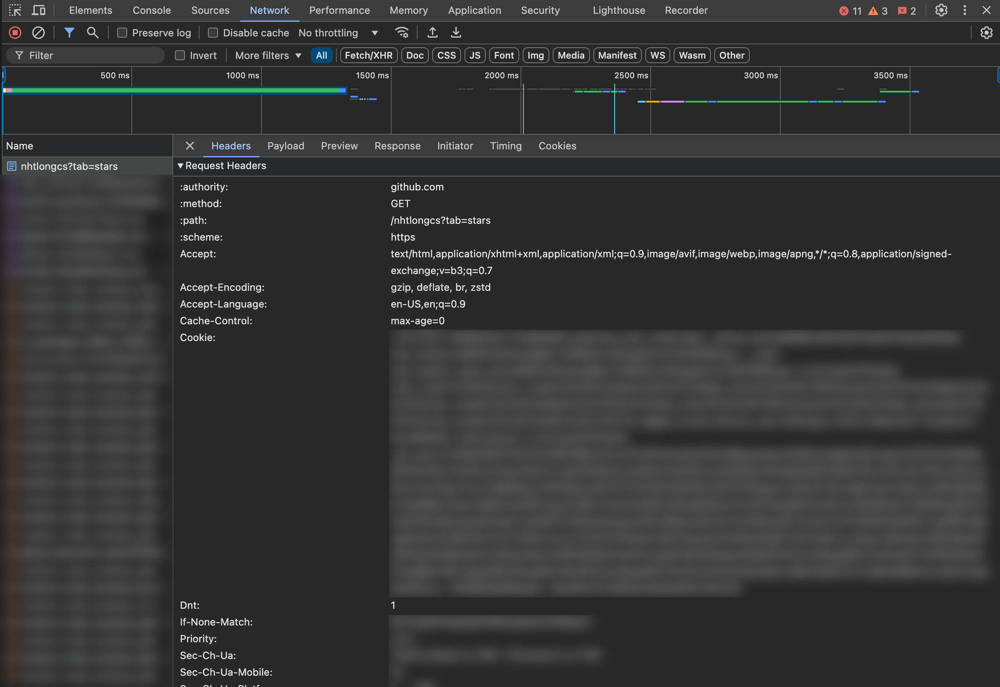

# 🌟 Github Starred List

A low-effort attempt to automate categorizing starred repositories on GitHub because the REST API isn't going to do that anytime soon.

## 🚀 Installation

```bash
pip install git+https://github.com/haile01/github-starred-list/
```

## 📖 Usage

Initialize with your GitHub username and the cookie header grabbed from `https://github.com/<username>?tab=stars`.

*Note: The cookie will only last for 2 weeks.*

```python
gh-list create --user "gh_username" --cookie "cookie_str" --list "listname" --desc "sample"

gh-list add --user "gh_username" --cookie "cookie_str" --list "listname" --repo "repo_url" 

gh-list remove --user "gh_username" --cookie "cookie_str --list "listname" --repo "repo_url"

gh-list delete --user "gh_username" --cookie "cookie_str" --list "listname"
```

For more information, run `gh-list --help`.

## ❓ FAQ

### How to get the cookie string?

To get the cookie string, open the browser console, go to the network tab, refresh the page, and click on the first request. Scroll down to the request headers and copy the cookie string.

The figure below shows the cookie string position in the browser console:



### I pasted the cookie string but it's not working?


- The cookie string is only valid for 2 weeks. If you encounter this issue, you need to grab a new cookie string. 
- Make sure the cookie string is enclosed in double quotes.
- Make sure the cookie string is copied correctly. The cookie string format should be `key=value; key=value; ...`. The expected cookie string format is shown below:
```cookies
_octo=<value>; 
preferred_color_mode=<value>; 
_device_id=<value>; 
user_session=<value>; 
__Host-user_session_same_site=<value>; 
tz=<value>; 
color_mode=<value>; 
logged_in=<value>; 
dotcom_user=<value>; 
GHCC=<value>; 
tz=<value>; 
_gh_sess=<value>;
```

## 🐞 Issues

If you encounter any issues, please report them [here](https://www.github.com/haile01/github-starred-list/issues/new).